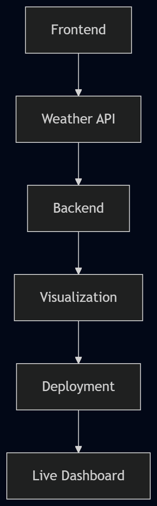
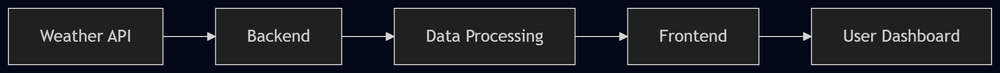

# 🌦️ WeatherDashboard

An interactive weather dashboard providing real-time forecasts, visualizations, and deployment via CI/CD pipelines.

## ✨ Features
- Real-time weather data from OpenWeatherMap API
- Interactive charts and visualizations
- Responsive frontend built with React
- Automated deployment pipeline (GitHub Actions → Netlify/Hostinger)
- Organized documentation with diagrams

## 🛠️ Workflow Diagram

## 🚀 CI/CD Pipeline

## 🔄 Data Flow


## ⚙️ Setup Instructions
1. Clone the repository:
   ```bash
   git clone https://github.com/damilolastephen89-creator/WeatherDashboard.git
   ```
2. Navigate into the project folder:
   ```bash
   cd WeatherDashboard
   ```
3. Install dependencies:
   ```bash
   npm install
   ```
4. Run locally:
      bash
   npm start
   
## 📦 Deployment
- CI/CD handled via **GitHub Actions**
- Hosting on **Netlify/Hostinger**
- Automatic build & deploy on commit to `main`

## 📜 License
This project is licensed under the MIT License.

## 👨‍💻 Author
**Gbemiga Damilola Stephen**  
Interactive weather solutions with modern web technologies.


